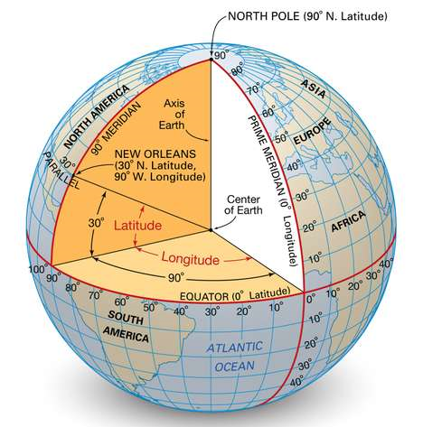

# Web Visualization Dashboard (Latitude)

## Background

Data is more powerful when we share it with others! Let's me share we've learned with data I got from OpenWeather API using HTML and CSS. 

## Latitude - Latitude Analysis Dashboard with Attitude

I have created a visualization dashboard website using visualizations I've created based on the analysis of data from OpenWeatherMap. Specifically, we'll be plotting [weather data](Resources/cities.csv).

In this dashboard, I have created individual pages for each plot and a means by which we can navigate between them. These pages contains the visualizations and their corresponding explanations. We'll also have a landing page, a page where we can see a comparison of all of the plots, and another page where we can view the data used to build them.

